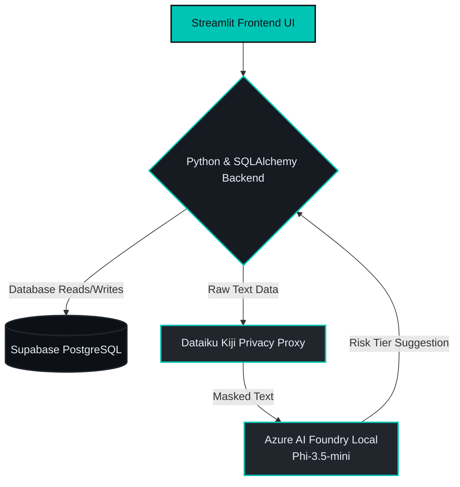

# GovernAI Presentation - Abhay's Assigned Slides (5, 6, & 7)

Here is the polished and upgraded content for your assigned slides. I've refined the language to sound more impactful and executive-ready.

---

## Slide 5: Key Features
(Visual Tip: Present as a 2x2 grid or four columns in Canva)

Slide Title: Key Features

Grid Content:

1. Compliance Engine:
Multi-framework mapping. Dynamically generates checklists and maps controls across both the EU AI Act and the NIST AI RMF based on risk tier.

2. Monitoring Dashboard:
Real-time operational tracking. Ingests performance metrics like drift, bias, hallucination rate, and cost via CSV file upload or simulation.

3. Risk Tier Suggestion:
AI-assisted risk setup. Evaluates the business purpose of systems using a local offline LLM (Phi-3.5-mini via Azure AI Foundry Local) with PII masking.

4. Automatic Status Transitions:
The Golden Thread logic. Breaches in operational metrics automatically degrade the compliance status and log an immutable entry in the audit trail.

---

## Slide 6: Enterprise-Grade Architecture
*(Visual Tip: Use a clean flowchart in Canva based on the structure below)*

*   **Slide Title:** Technical Architecture
*   **Content:**
    *   **Interactive Frontend:** **Streamlit** (Custom dark theme, responsive, data-driven UI).
    *   **Robust Backend Core:** **Python** paired with **SQLAlchemy ORM** for structured business logic.
    *   **Centralized Cloud Database:** **Supabase PostgreSQL** acting as the single source of truth (relational tables, strict UUID integrity).
    *   **Local AI & Privacy Stack:**
        *   **Azure AI Foundry Local:** Runs offline AI inferences securely.
        *   **Dataiku Kiji Proxy:** Redacts sensitive PII (Names, SSNs) before it hits the LLM.

### Reference Architecture Diagram
*(You can use this layout as a reference to build your visual diagram in Canva!)*

---

## Slide 7: The User Journey
*(Visual Tip: Present this as a timeline/journey flow or three separate role-based boxes)*

*   **Slide Title:** Usage & Workflow
*   **Role Breakdown:**
    *   **AI Engineers / System Owners:** Register new AI models in the central vault and seamlessly monitor operational health across the entire portfolio.
    *   **Risk & Security Officers:** Safely assess risk tiers utilizing our guided EU AI Act framework and AI-assisted classification tools.
    *   **Compliance & Audit Teams:** Upload live performance metrics, verify safeguard evidence, and export tamper-proof PDF audit reports in seconds.
